# SPI Driver for AD7124-8 Precision ADC
 
A bare-metal SPI driver for the **Analog Devices AD7124-8** 24-bit sigma-delta ADC, developed on a **Silicon Labs EFM32** microcontroller using Simplicity Studio. Implemented as part of an embedded systems internship at INNIRION GmbH, Freiburg.
 
---
 
## Hardware
 
| Component | Part |
|---|---|
| ADC | AD7124-8BCPZ (24-bit, sigma-delta, 8-channel) |
| MCU | Silicon Labs EFM32 (EFR32xG series) |
| Interface | SPI Mode 3 (CPOL=1, CPHA=1), USART0 |
| Reference Voltage | ADR3625ARMZ — 2.500 V precision reference |
| AVDD LDO | ADP7118 — 3.00 V regulated supply |
| Logic Analyser | Saleae Logic 2 |
| IDE | Simplicity Studio (GCC ARM toolchain) |
| Debugger | SEGGER J-Link |
 
**Pin mapping (EFM32 → AD7124):**
 
| Signal | EFM32 Pin |
|---|---|
| SPI CS | PA4 |
| SPI MOSI | PB2 |
| SPI MISO | PB3 |
| SPI SCK | PB4 |
 
---
 
## Implementation
 
### Task 1 — SPI Hardware Init & First Byte
 
Configured USART0 as a synchronous SPI master (Mode 3: CPOL=1, CPHA=1) with GPIO routing for MOSI, MISO, SCK, and a software-controlled CS on PA4. Sent the first test byte `0xAA` to verify the bus.
 
```c
void initUSART0(void) {
    CMU_ClockEnable(cmuClock_USART0, true);
    USART_InitSync_TypeDef init = USART_INITSYNC_DEFAULT;
    init.msbf      = true;
    init.clockMode = usartClockMode3; // CPOL=1, CPHA=1
    USART_InitSync(USART0, &init);
}
```
 
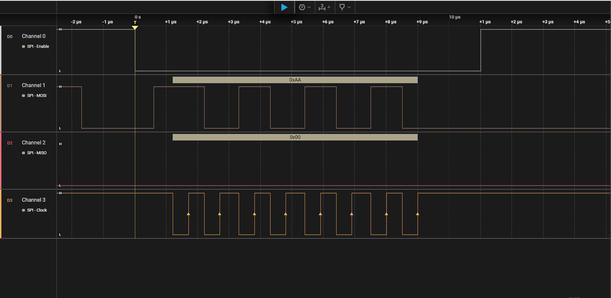
 
---
 
### Task 2 — Register Read (ID Register)
 
Single-byte read using the AD7124 command byte format: `0x40 | address`. Read the ID register to verify SPI communication.
 
```c
uint8_t ad7124_read_register(uint8_t address) {
    uint8_t command = 0x40 | (address & 0x3F);
    GPIO_PinOutClear(SPI_CS_PORT, SPI_CS_PIN);
    USART_SpiTransfer(USART0, command);
    uint8_t result = USART_SpiTransfer(USART0, 0x00);
    GPIO_PinOutSet(SPI_CS_PORT, SPI_CS_PIN);
    return result;
}
```
 
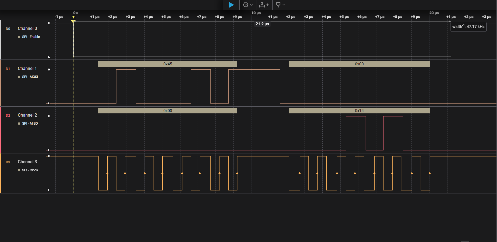
 
---
 
### Task 3 — Soft Reset
 
Sends 8 consecutive `0xFF` bytes to trigger the AD7124 hardware reset sequence.
 
```c
void ad7124_soft_reset(void) {
    GPIO_PinOutClear(SPI_CS_PORT, SPI_CS_PIN);
    for (int i = 0; i < 8; i++)
        My_SpiTransfer(USART0, 0xFF);
    GPIO_PinOutSet(SPI_CS_PORT, SPI_CS_PIN);
}
```
 
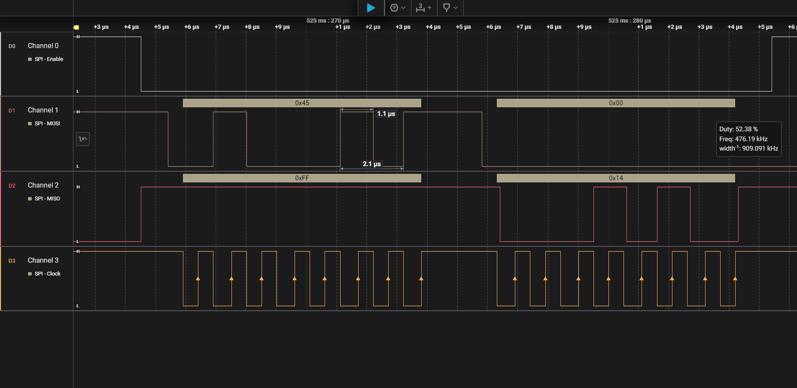
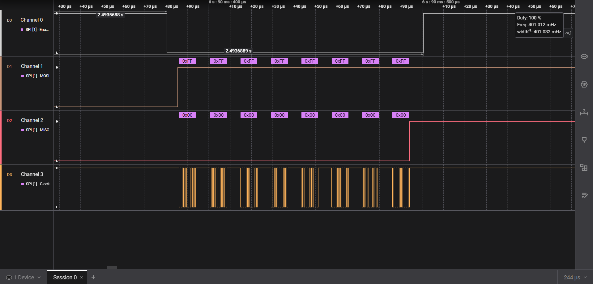
 
---
 
### Task 4 — Status Register Read
 
Read the STATUS register to check the RDY bit and active channel ID.
 
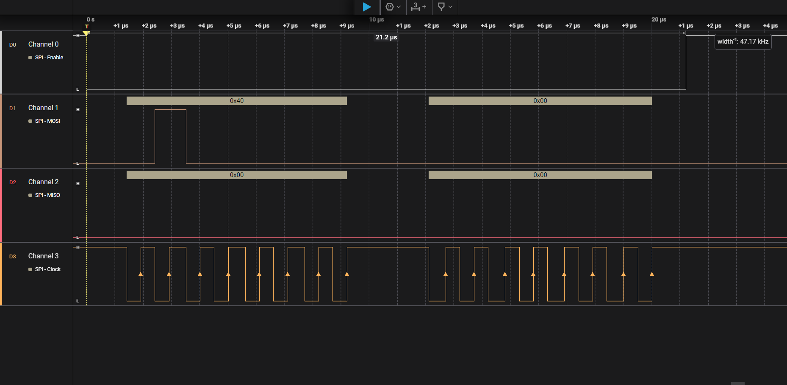
.png)
.png)
 
---
 
### Task 5 — ADC Control & Full Register Configuration
 
Configured ADC_CONTROL, ERROR_ENABLE, CHANNEL0, CONFIG0, and FILTER0:
 
- **ADC_CONTROL:** Standby mode, internal reference enabled
- **CONFIG0:** REFIN1, bipolar mode, all buffers on, gain = 1
- **FILTER0:** Sinc3, ~5 SPS output rate
- **CHANNEL0:** AIN0+, AIN1−, linked to CONFIG0
```c
uint16_t ad7124_calc_fs(float desired_sps, ad7124_power_mode_t pwr) {
    float fclk_hz = 153600.0f; // mid-power clock
    float fs_f = fclk_hz / (32.0f * desired_sps);
    return (uint16_t)(fs_f + 0.5f);
}
```
 
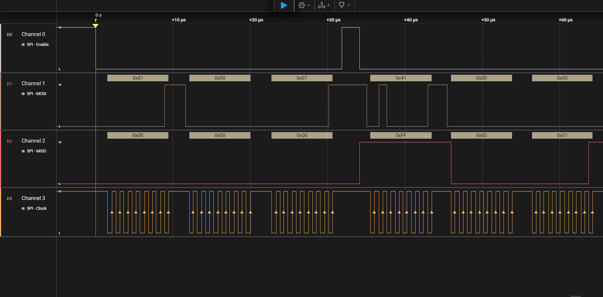
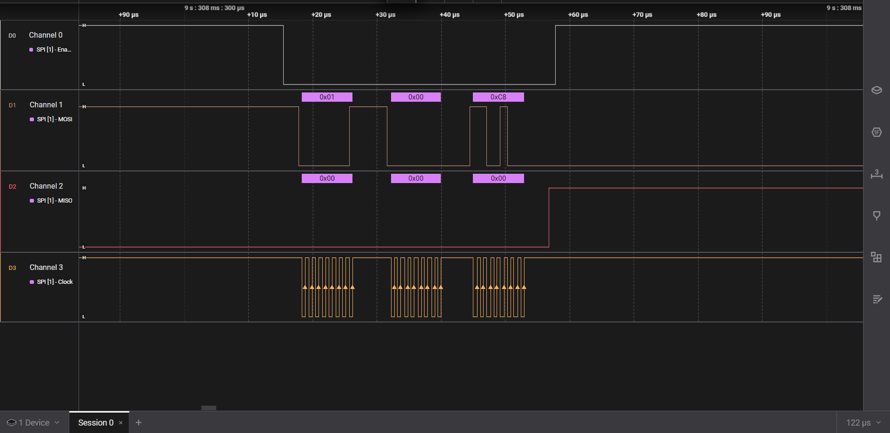
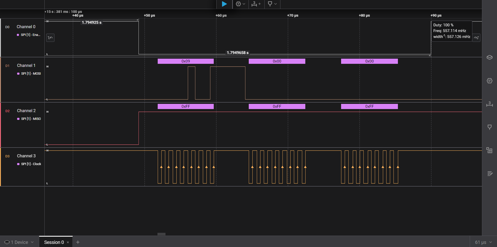
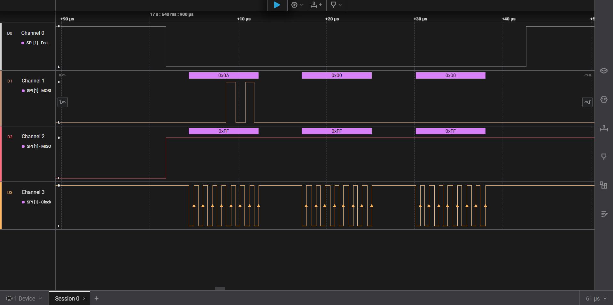
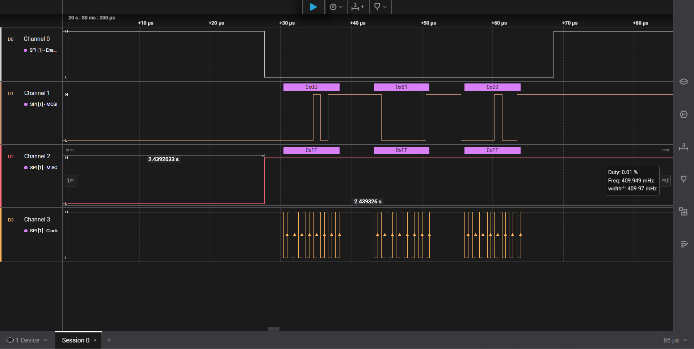
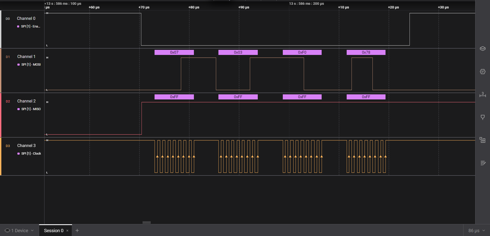
 
---
 
### Task 6 — Continuous Conversion Loop
 
Switched ADC to continuous conversion mode. Polled STATUS, ERROR, and DATA registers. Raw 24-bit values converted to millivolts:
 
```c
float convertToMillivolts(uint32_t raw, bool bipolar, int gain) {
    float offset     = bipolar ? 8388608.0f : 0.0f;
    float resolution = bipolar ? 8388608.0f : 16777216.0f;
    float vref_mV    = 2500.0f;
    return ((float)raw - offset) * (vref_mV / resolution / (float)gain);
}
```
 
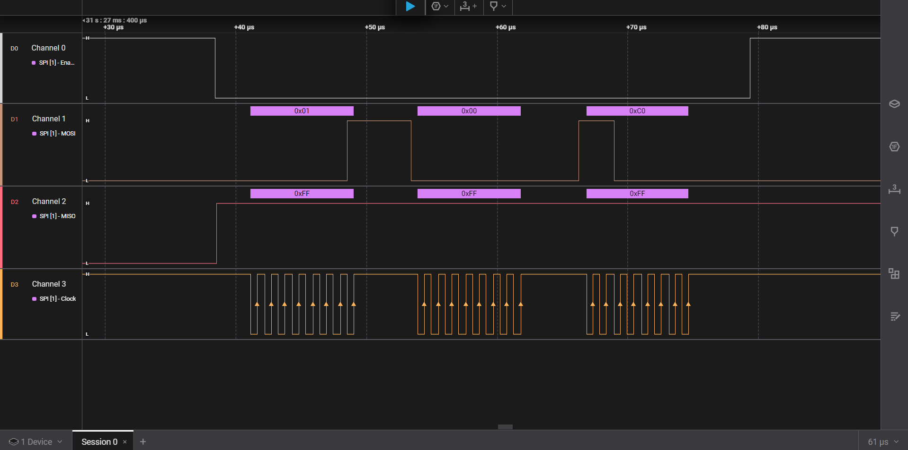
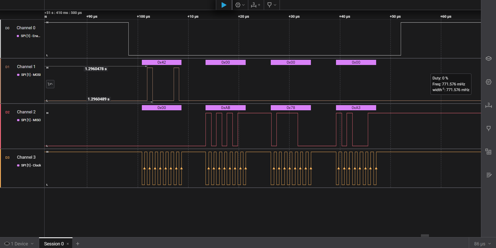
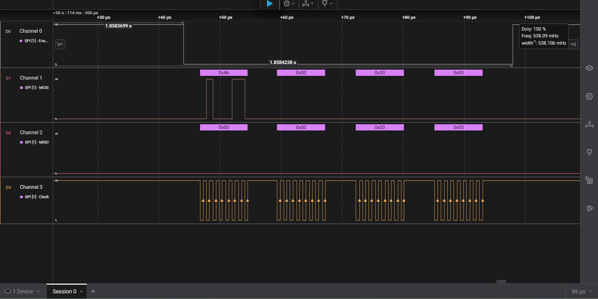
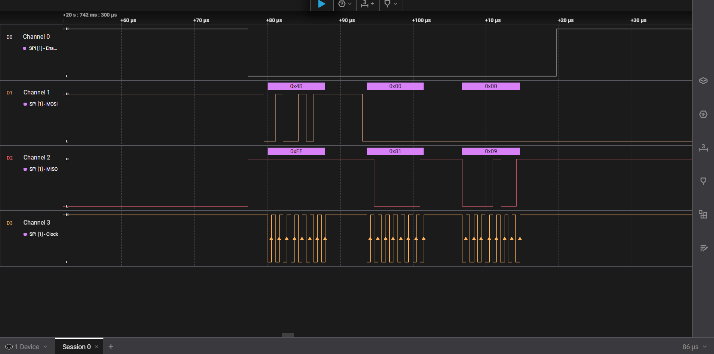
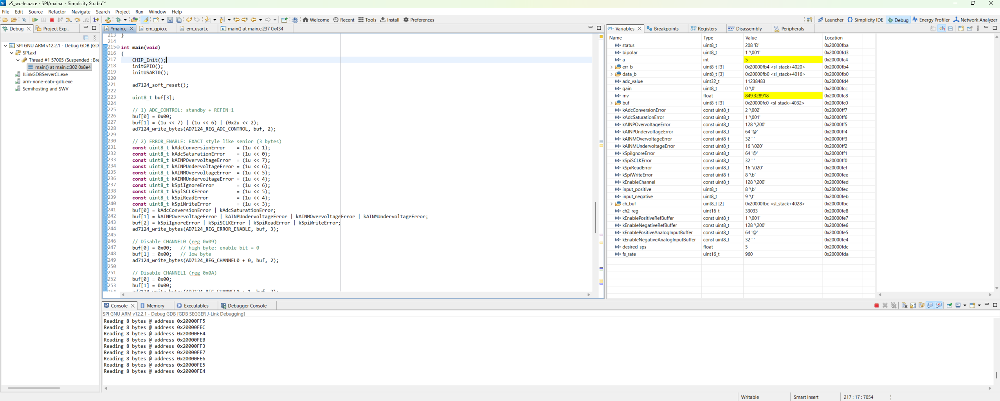
 
---
 
## Debugger Screenshots
 
All register values verified live in Simplicity Studio via SEGGER J-Link.
 
| Register | Screenshot |
|---|---|
| Pin Configuration | 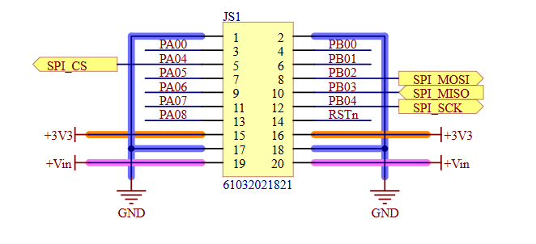 |
| CONFIG0 | 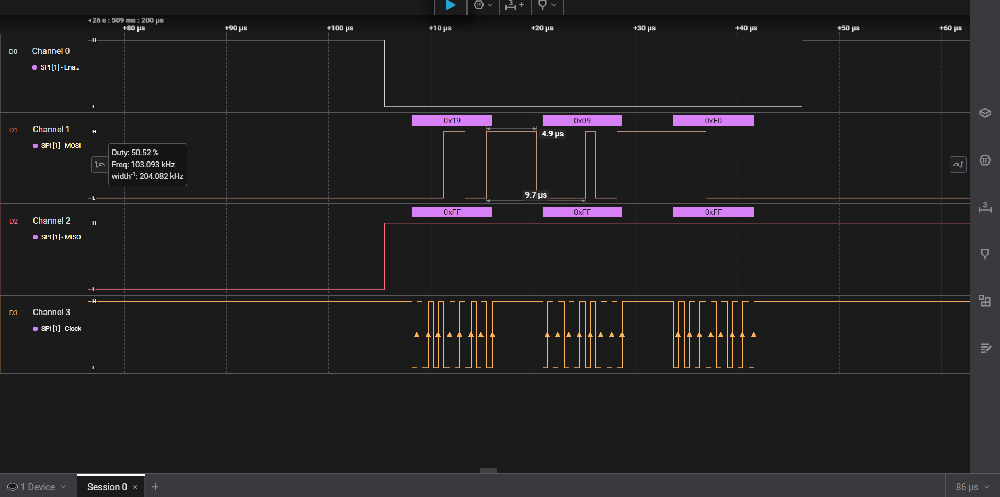 |
| FILTER0 | 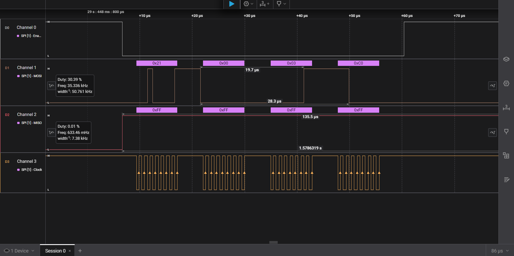 |
 
---
 
## Tools & Environment
 
- **IDE:** Simplicity Studio 5 (Silicon Labs)
- **Toolchain:** GCC ARM
- **Debugger:** SEGGER J-Link
- **Logic Analyser:** Saleae Logic 2
- **ADC Datasheet:** [AD7124-8 (Analog Devices)](https://www.analog.com/en/products/ad7124-8.html)
